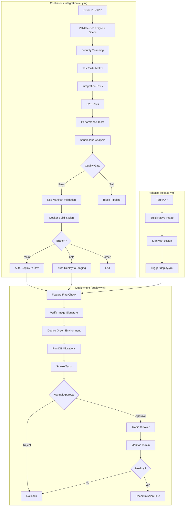

# GitHub Actions Workflows

This directory contains the CI/CD automation workflows for Village Storefront.

## Overview

Village Storefront uses a sophisticated CI/CD pipeline with automated quality gates, security scanning, blue/green deployments, and feature flag controls.



---

## Workflows

### `ci.yml` - Continuous Integration

**Triggers:**
- Push to any branch
- Pull requests

**Purpose:** Validates code quality, runs tests, builds artifacts, and auto-deploys to dev/staging.

**Jobs:**

1. **validate** (~2-3 min)
   - Spotless code formatting check
   - OpenAPI specification linting (Spectral)
   - PlantUML diagram validation
   - OpenAPI diff vs base branch (PRs only)

2. **security-scan** (~5-10 min)
   - OWASP Dependency-Check (Maven + npm)
   - Trivy container vulnerability scan
   - Upload SARIF results to GitHub Security tab

3. **test** (~10-15 min)
   - Matrix: JVM + Native (native only on main/beta)
   - Unit tests with JaCoCo coverage
   - Integration tests with Testcontainers (PostgreSQL, MinIO)
   - Coverage threshold: 80% minimum

4. **integration-tests** (~5-10 min)
   - Full stack integration tests
   - Database migrations
   - Multi-tenant scenarios

5. **e2e-tests** (~10-15 min)
   - Playwright browser tests
   - Mobile viewport testing
   - Accessibility checks

6. **e2e-visual** (~5-10 min)
   - Percy visual regression testing
   - Screenshot comparison vs baseline

7. **admin-spa** (~5-10 min)
   - Cypress component tests
   - Admin UI integration tests

8. **lighthouse-performance** (~5-10 min)
   - Lighthouse CI performance audits
   - Performance budgets: LCP < 2s, Score > 90
   - Accessibility score > 95

9. **performance-test** (~10-15 min)
   - k6 load testing
   - Stress test scenarios
   - Performance regression detection

10. **sonarcloud** (~5-10 min)
    - Code quality analysis
    - Quality gate: ≥80% coverage, 0 bugs, 0 vulnerabilities
    - **BLOCKS PIPELINE IF FAILS**

11. **validate-manifests** (~2-3 min)
    - Kustomize build validation
    - kubectl dry-run for dev/staging/prod overlays

12. **docker-build** (~10-20 min)
    - Docker image build (linux/amd64)
    - Push to GHCR (ghcr.io/villagecompute/village-storefront)
    - Cosign keyless signing (GitHub OIDC)
    - Tags: `sha-<commit>`, `latest` (main), `beta` (beta)

13. **promote-to-dev** (~1 min)
    - Triggers on: Push to `main` branch
    - Sends repository_dispatch event to deploy.yml
    - Automatic deployment to dev environment

14. **promote-to-staging** (~1 min)
    - Triggers on: Push to `beta` branch
    - Sends repository_dispatch event to deploy.yml
    - Automatic deployment to staging environment

**Total Duration:**
- **PR builds:** ~15-25 minutes (skips native build, docker build)
- **Main branch:** ~25-40 minutes (includes native build, docker build, auto-deploy trigger)

**Dependencies:**
```
validate → security-scan, test, integration-tests, e2e-tests, admin-spa
test → sonarcloud
integration-tests → sonarcloud
e2e-tests → lighthouse-performance, performance-test
admin-spa → sonarcloud
security-scan → docker-build
sonarcloud → docker-build, validate-manifests
docker-build → promote-to-dev / promote-to-staging
```

**Artifacts Produced:**
- Lint reports (retention: 14 days)
- OpenAPI specification (retention: 90 days)
- PlantUML diagrams (retention: 90 days)
- Dependency-Check reports (retention: 30 days)
- Trivy SARIF results (retention: 30 days)
- Test results (retention: 30 days)
- Coverage reports (retention: 30 days)
- Playwright traces (retention: 30 days)
- Lighthouse reports (retention: 14 days)
- k6 performance results (retention: 30 days)

---

### `deploy.yml` - Blue/Green Deployment

**Triggers:**
- `workflow_dispatch` (manual)
- `workflow_call` (called by other workflows)
- `repository_dispatch` (automatic from ci.yml)
- `push` to tags `v*.*.*` (production release)

**Purpose:** Deploys application to Kubernetes using blue/green strategy with automated rollback.

**Jobs:**

1. **validate-feature-flags** (~1 min)
   - Checks critical kill switches in production ConfigMap
   - Blocks deployment if kill switches active
   - Can be skipped with `skip_feature_flag_check=true` (emergency only)

2. **verify-image-signature** (~1 min)
   - Verifies container image signed with cosign
   - Validates GitHub OIDC identity
   - **BLOCKS DEPLOYMENT IF VERIFICATION FAILS**

3. **validate-manifests** (~2-3 min)
   - Builds Kustomize manifests for target environment
   - kubectl dry-run validation
   - Uploads validated manifests as artifact

4. **deploy-green** (~5-10 min)
   - Creates green namespace (`village-storefront-{env}-green`)
   - Deploys all components (gateway, workers, media-workers)
   - Waits for all pods to reach Ready state
   - Verifies health endpoints

5. **run-database-migrations** (~2-5 min)
   - **Production only** (staging/dev migrations run at startup)
   - Executes forward-compatible migrations
   - Verifies migration status

6. **smoke-test** (~2-3 min)
   - Health endpoints (liveness, readiness)
   - Metrics endpoint
   - API endpoints (catalog, checkout)
   - **TRIGGERS ROLLBACK IF FAILS**

7. **approval** (~variable, manual)
   - GitHub environment protection rule
   - Requires manual approval before traffic cutover
   - Review smoke test results, pod metrics, logs

8. **cutover-traffic** (~1 min)
   - Patches ingress to route traffic to green service
   - Verifies traffic flowing to green pods

9. **monitor-green** (~15 min)
   - Monitors pod metrics (CPU, memory)
   - Checks for errors in logs
   - **TRIGGERS ROLLBACK IF ISSUES DETECTED**

10. **decommission-blue** (~1 min)
    - Scales blue deployments to 0 replicas
    - Preserves blue namespace for 24h rollback window

11. **rollback** (on failure, ~1 min)
    - Reverts ingress to blue service
    - Scales down green deployments
    - Creates incident report

**Total Duration:**
- **Dev:** ~10-15 minutes (skips smoke tests, approval, monitoring)
- **Staging:** ~25-35 minutes + manual approval
- **Production:** ~45-60 minutes + manual approval + 15 min monitoring

**Environments:**

| Environment | Namespace | URL | Auto-Deploy | Approval Required | Smoke Tests | Monitoring |
|-------------|-----------|-----|-------------|-------------------|-------------|------------|
| `dev` | `village-storefront-dev` | https://dev.villagecompute.com | Yes (on main push) | No | Skipped | Skipped |
| `staging` | `village-storefront-staging` | https://staging.villagecompute.com | Yes (on beta push) | Yes | Full suite | 15 min |
| `production` | `village-storefront-production` | https://villagecompute.com | No (manual tag) | Yes | Full suite | 15 min |

**Rollback Triggers:**
- Green pods fail to reach Ready state
- Health endpoints return errors
- Smoke tests fail
- High error rate during monitoring period
- Manual rollback via workflow cancellation

---

### `release.yml` - Production Release

**Triggers:**
- Push to tags matching `v*.*.*` (e.g., `v1.2.3`)

**Purpose:** Builds production-ready native executable and triggers production deployment.

**Jobs:**

1. **build-native** (~20-30 min)
   - Builds GraalVM native executable
   - Smaller image size (~50-100MB vs ~300MB JVM)
   - Faster cold start (<100ms vs ~2-3s JVM)
   - Push to GHCR with semver tags

2. **sign-image** (~1 min)
   - Signs image with cosign keyless signing
   - Uses GitHub OIDC identity
   - Pushes signature to Rekor transparency log

3. **create-release** (~1 min)
   - Creates GitHub Release with tag
   - Attaches changelog
   - Links to deployment workflow run

4. **deploy-production** (calls deploy.yml)
   - Triggers blue/green deployment to production
   - Full quality gates + manual approval
   - See deploy.yml timeline above

**Total Duration:** ~60-90 minutes (native build + deployment)

**Tags Produced:**
- `v1.2.3` (exact version)
- `v1.2` (minor version)
- `v1` (major version)
- `sha-<commit>` (commit SHA)
- `latest` (latest release)

---

### `test_suite.yml` - Comprehensive Test Suite

**Triggers:**
- Manual workflow_dispatch
- Nightly cron schedule (03:00 UTC)
- Called by ci.yml for full test runs

**Purpose:** Runs complete test suite including long-running tests not run on every PR.

**Jobs:**
- Full integration test matrix (PostgreSQL versions 15, 16, 17)
- Load testing with k6 (longer duration scenarios)
- Soak tests (24-hour stability)
- Chaos engineering tests (pod failures, network delays)
- Database migration tests (up + down)

**Total Duration:** ~2-4 hours

---

## Workflow Configuration

### Required GitHub Secrets

| Secret | Used By | Purpose |
|--------|---------|---------|
| `SONAR_TOKEN` | ci.yml | SonarCloud authentication |
| `NVD_API_KEY` | ci.yml | OWASP Dependency-Check NVD API |
| `KUBECONFIG` | deploy.yml | Kubernetes cluster access (base64) |
| `PRODUCTION_DB_URL` | deploy.yml | PostgreSQL connection URL |
| `PRODUCTION_DB_USER` | deploy.yml | Database username |
| `PRODUCTION_DB_PASSWORD` | deploy.yml | Database password |
| `PERCY_TOKEN` | ci.yml | Percy visual testing (optional) |

### Required GitHub Variables

| Variable | Value | Purpose |
|----------|-------|---------|
| `DOCKER_ENABLED` | `true` | Enable Docker build/push in ci.yml |

### Required GitHub Environments

| Environment | Protection Rules | Reviewers |
|-------------|------------------|-----------|
| `dev` | None | - |
| `staging` | Manual approval | Platform team |
| `staging-cutover` | Manual approval | Platform lead |
| `production` | Manual approval + branch protection | Platform lead + Product manager |
| `production-cutover` | Manual approval | Platform lead |

---

## Caching Strategy

### Maven Repository Cache
- **Key:** `${{ runner.os }}-maven-${{ hashFiles('**/pom.xml') }}`
- **Path:** `.m2/repository`
- **TTL:** 7 days
- **Hit Rate:** ~85% (refreshed when dependencies change)

### npm Cache
- **Key:** `${{ runner.os }}-node-${{ hashFiles('**/package-lock.json') }}`
- **Path:** `~/.npm`
- **TTL:** 7 days
- **Hit Rate:** ~90%

### GraalVM Native Image Cache
- **Key:** `${{ runner.os }}-graalvm-${{ hashFiles('**/pom.xml') }}`
- **Path:** `~/.graalvm-cache`
- **TTL:** 30 days
- **Hit Rate:** ~70% (slower to warm up)

### SonarCloud Cache
- **Key:** `sonarcloud-cache-${{ github.run_id }}`
- **Path:** `.sonar/cache`
- **TTL:** 7 days
- **Hit Rate:** ~75%

### Docker Buildx Cache
- **Type:** `gha` (GitHub Actions cache)
- **Mode:** `max` (cache all layers)
- **TTL:** 7 days
- **Hit Rate:** ~80%

---

## Quality Gates

### SonarCloud Quality Gate (APPI Profile)

**Requirements:**
- **Coverage:** ≥80% on new code
- **Duplications:** ≤3% on new code
- **Bugs:** 0 on new code
- **Vulnerabilities:** 0 on overall code
- **Code Smells:** ≤5 on new code
- **Security Hotspots:** All reviewed

**Enforcement:**
- `sonarcloud` job blocks pipeline if quality gate fails
- `docker-build` and deployment jobs depend on `sonarcloud` passing
- PR status check prevents merge if quality gate fails

### Security Scanning Quality Gates

**OWASP Dependency-Check:**
- **Block:** CRITICAL vulnerabilities
- **Warn:** HIGH vulnerabilities (manual review required)
- **Allow:** MEDIUM/LOW vulnerabilities (create issue for tracking)

**Trivy Container Scan:**
- **Block:** CRITICAL vulnerabilities in final image
- **Warn:** HIGH vulnerabilities (manual review required)
- **Report:** All findings to GitHub Security tab

### Test Coverage Quality Gates

**Minimum Requirements:**
- **Line Coverage:** 80%
- **Branch Coverage:** 75%
- **Mutation Score:** 70% (future goal, not enforced yet)

**Enforcement:**
- JaCoCo Maven plugin configured with `<haltOnFailure>true</haltOnFailure>`
- SonarCloud quality gate duplicates coverage check
- Coverage reports uploaded to Codecov for trending

### Performance Quality Gates

**Lighthouse CI Budgets:**
- **LCP (Largest Contentful Paint):** < 2.0s
- **Performance Score:** > 90
- **Accessibility Score:** > 95
- **Best Practices Score:** > 95
- **SEO Score:** > 90

**k6 Load Test Thresholds:**
- **http_req_duration p95:** < 500ms
- **http_req_failed rate:** < 1%
- **http_reqs rate:** > 100 req/s

---

## Troubleshooting

### CI Pipeline Failures

**SonarCloud Quality Gate Failed:**
```bash
# View detailed report
gh run view --log | grep -A 50 "SonarCloud"

# Check coverage locally
./mvnw clean test jacoco:report
open target/site/jacoco/index.html

# Run SonarCloud analysis locally
./mvnw sonar:sonar -Dsonar.login=$SONAR_TOKEN
```

**Docker Build Fails:**
```bash
# Check Docker build logs
gh run view --log | grep -A 100 "docker-build"

# Test Docker build locally
docker build -t village-storefront:local -f Dockerfile .

# Check disk space (GH runners have limited space)
df -h
docker system prune -af
```

**Playwright Tests Flaky:**
```bash
# Download test artifacts
gh run download <run-id> -n playwright-report

# Run tests locally in headed mode
npx playwright test --headed --project=chromium

# Update visual baselines
npx playwright test --update-snapshots
```

### Deployment Failures

**Feature Flag Check Blocks Deployment:**
```bash
# Check kill switch status
kubectl get configmap feature-flags \
  -n village-storefront-production \
  -o yaml

# Disable kill switch
kubectl edit configmap feature-flags -n village-storefront-production
# Change checkout.kill-switch: "false" → "true"

# Or skip check (emergency only)
gh workflow run deploy.yml \
  -f environment=production \
  -f image_tag=v1.2.3 \
  -f skip_feature_flag_check=true
```

**Image Signature Verification Failed:**
```bash
# Verify image manually
cosign verify \
  --certificate-identity-regexp="^https://github.com/villagecompute/village-storefront" \
  --certificate-oidc-issuer="https://token.actions.githubusercontent.com" \
  ghcr.io/villagecompute/village-storefront:v1.2.3

# Check if image was signed
gh run view <ci-run-id> --log | grep "cosign sign"

# Re-trigger CI to rebuild and re-sign
gh workflow run ci.yml --ref main
```

**Smoke Tests Failed:**
```bash
# View smoke test logs
gh run view <deploy-run-id> --log | grep -A 50 "smoke-test"

# Check green environment health
kubectl get pods -n village-storefront-production-green
kubectl logs -l app=village-storefront -n village-storefront-production-green

# Port-forward to test manually
kubectl port-forward -n village-storefront-production-green \
  svc/village-storefront-gateway 8080:8080

curl -v http://localhost:8080/q/health/live
```

**Deployment Rollback Triggered:**
```bash
# Check rollback reason
gh run view <deploy-run-id> --log | grep "ROLLBACK"

# Verify blue environment still running
kubectl get pods -n village-storefront-production

# Check incident report
gh run view <deploy-run-id>  # View GITHUB_STEP_SUMMARY

# File postmortem issue
gh issue create --title "Deployment rollback: v1.2.3" \
  --label "incident" \
  --body "See deployment run: <URL>"
```

---

## Performance Optimization

### Reducing CI Duration

**Current Bottlenecks:**
1. Native build (~15-20 min)
2. Integration tests (~10-15 min)
3. Docker build (~10-15 min)
4. SonarCloud upload (~5-10 min)

**Optimization Strategies:**

**1. Conditional Native Builds:**
```yaml
# Only run native builds on main/beta branches
if: github.ref == 'refs/heads/main' || github.ref == 'refs/heads/beta'
```

**2. Parallel Job Execution:**
```yaml
# Current: Most jobs run in parallel after validate
# Optimized: Move independent jobs to separate stages
```

**3. Selective Test Execution:**
```bash
# Use GitHub PR labels to skip expensive tests
if: !contains(github.event.pull_request.labels.*.name, 'skip-e2e')
```

**4. Matrix Optimization:**
```yaml
# Run full matrix on main, reduced on PRs
matrix:
  runtime: ${{ github.event_name == 'pull_request' && ['jvm'] || ['jvm', 'native'] }}
```

### Improving Cache Hit Rates

**Maven Cache Optimization:**
```yaml
# Use more specific cache keys
cache-key: ${{ runner.os }}-maven-${{ hashFiles('**/pom.xml') }}-${{ hashFiles('.mvn/wrapper/maven-wrapper.properties') }}
```

**Docker Layer Caching:**
```dockerfile
# Order Dockerfile to maximize cache hits
# 1. Copy dependency files first
COPY pom.xml .
COPY .mvn .mvn
# 2. Download dependencies (cached if pom.xml unchanged)
RUN ./mvnw dependency:go-offline
# 3. Copy source code last (invalidates cache less frequently)
COPY src src
```

---

## Metrics & Monitoring

### Workflow Success Rate

**Target:** > 95% success rate on main branch

**Query:**
```bash
# Success rate last 30 days
gh run list --workflow=ci.yml --branch=main --limit=100 --json conclusion | \
  jq '[.[] | select(.conclusion == "success")] | length / 100 * 100'
```

### Average Build Duration

**Target:** < 30 minutes for PR builds, < 45 minutes for main

**Query:**
```bash
# Average duration last 30 runs
gh run list --workflow=ci.yml --limit=30 --json durationMs | \
  jq '[.[].durationMs] | add / length / 1000 / 60'
```

### Deployment Frequency

**Target:** > 5 deployments per week to production

**Query:**
```bash
# Production deployments last 7 days
gh run list --workflow=deploy.yml --limit=100 --json createdAt,conclusion | \
  jq '[.[] | select(.createdAt > (now - 7*86400 | strftime("%Y-%m-%dT%H:%M:%SZ")))] | length'
```

### Rollback Rate

**Target:** < 5% of deployments rolled back

**Query:**
```bash
# Check for rollback job executions
gh run list --workflow=deploy.yml --limit=100 --json jobs | \
  jq '[.[] | .jobs[] | select(.name == "rollback")] | length'
```

---

## Future Enhancements

### Planned Improvements

1. **Merge Queue Integration**
   - Auto-merge approved PRs after final CI pass
   - Prevent merge conflicts in main branch
   - Estimated savings: ~30 min per merge conflict

2. **Canary Deployments**
   - Extend blue/green strategy to support canary releases
   - Roll out to 10% → 50% → 100% of traffic
   - Auto-rollback on elevated error rates

3. **Progressive Delivery with Flagger**
   - Automated canary analysis with Prometheus metrics
   - Slack notifications for canary progress
   - Integration with feature flag system

4. **Dependency Update Automation**
   - Renovate bot for automated dependency PRs
   - Auto-merge minor/patch updates if CI passes
   - Weekly summary of available major updates

5. **Performance Regression Detection**
   - Automated performance comparison vs baseline
   - Block deployment if response time regresses > 10%
   - Capture flame graphs for analysis

6. **ChatOps Integration**
   - Deploy via Slack commands: `/deploy production v1.2.3`
   - View deployment status in Slack threads
   - Approve/rollback from Slack interface

---

## Resources

### Documentation
- [Release Runbook](../../docs/operations/release-runbook.md)
- [Operations Runbook](../../docs/operations/runbook.md)
- [Deployment Architecture](../../docs/architecture/ops/deployment-architecture.md)

### External Links
- [GitHub Actions Documentation](https://docs.github.com/en/actions)
- [Kustomize Documentation](https://kustomize.io/)
- [Cosign Documentation](https://docs.sigstore.dev/cosign/overview/)
- [SonarCloud Documentation](https://docs.sonarcloud.io/)

### Support
- **Platform Engineering:** platform-eng@villagecompute.com
- **On-Call:** PagerDuty rotation
- **Slack:** #platform-engineering, #deployments

---

**Last Updated:** 2026-01-18
**Maintained By:** Platform Engineering Team
